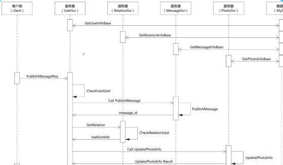
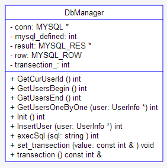

<!-- TOC -->

- [消息交互](#消息交互)
- [Protobuf](#protobuf)
- [性能测试](#性能测试)
- [性能优化](#性能优化)
- [UML](#uml)
  - [User](#user)
  - [Relation](#relation)
  - [Message](#message)
  - [Photo](#photo)
  - [DataBase](#database)
  - [Bus](#bus)

<!-- /TOC -->


## 消息交互




## Protobuf

变长数值表示方式，对比传统数值类型表现方式，当表示小于128的数字时，可以用一个字节表示，而对于较大的数字会使用超过传统数值类型的字节数表示值。

- message_define.proto: 服务器客户端信息交互消息体，各种请求和响应代码设计
- user_info_base.proto: 用户信息
- relation_info_base.proto: 好友关系和黑白名单
- message_info_base.proto: 用户发布动态的信息
- photo_info_base.proto: 用户发布动态快照（消息提示小红点）的信息


## 性能测试

CPU、内存、网络流量


瞬发模型：瞬间多个请求，可能导致部分请求等待其他请求处理完成，客户端响应时间变长。

均匀模型：每个请求是几乎不并行的，接近一个请求处理完毕才有下一个请求出现。


每个请求逻辑：

1. login
2. add friend
3. publish
4. get photo
5. delete friend

设置每秒 10000 连接时，处理请求量在2核云主机上限制在6000+处理量。

```shell
top -d 1 -p pid -n 30 > cpu.txt

// 双核（当前整机）的使用量
// 关注 usr，sys，idel 列数据，绘制图表
// usr+sys+idel 数据监控
cat cpu.txt | grep Cpu

// 单核的使用量（进程CPU监控）
cat cpu.txt | grep < 用户名或者程序名 >

// 内存使用量（只有数据库创建用户时用量变化，之后用量平稳）
// 如果不平稳，应该内存泄漏
cat cpu.txt | grep "KiB Mem"
```

```shell
sar -n DEV 1 30 > net.txt
```

sar 统计收发包数据。收包数，发包数，收包量Kb，发包量Kb，平均发包大小，平均收包大小。


​												内存使用


瓶颈

```shell
sudo perf record ./server

sudo perf report
```


## 性能优化


内存设计

根据读写权限设置，设计内存空间区域

- server写，UserServer1读
- server写，UserServer2读
- UserServer1写，server读
- UserServer2写，server读


## UML

### User


### Relation


### Message


### Photo


### DataBase




### Bus


